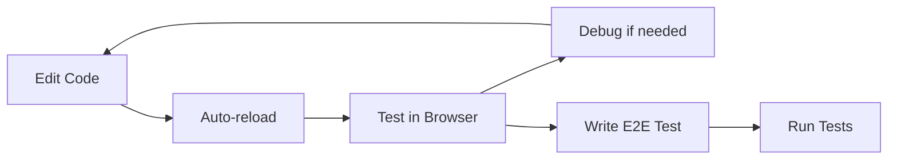

# Project Structure

Complete overview of all files and directories in this project.

```
python-quart-vite-react/
│
├── backend/                      # Python Quart Backend
│   ├── app.py                   # Main application file
│   ├── requirements.txt         # Python dependencies
│   └── venv/                    # Virtual environment (created during setup)
│
├── frontend/                     # React Frontend
│   ├── src/
│   │   ├── components/          # Reusable UI components
│   │   │   └── About.jsx        # About page component
│   │   │
│   │   ├── features/            # Feature modules
│   │   │   ├── dashboard/       # Dashboard feature
│   │   │   │   └── Dashboard.jsx    # Real-time server info
│   │   │   │
│   │   │   └── tasks/           # Task management feature
│   │   │       ├── TaskList.jsx     # Task list with CRUD
│   │   │       └── TaskDialog.jsx   # Create/edit dialog
│   │   │
│   │   ├── services/            # API and service layer
│   │   │   └── api.js           # Backend API client
│   │   │
│   │   ├── App.jsx              # Main application component
│   │   ├── main.jsx             # React entry point
│   │   └── index.css            # Global styles
│   │
│   ├── index.html               # HTML entry point
│   ├── package.json             # Node.js dependencies
│   ├── vite.config.js           # Vite configuration
│   └── node_modules/            # Installed packages (created during setup)
│
├── tests/
│   └── e2e/                     # End-to-end tests
│       └── app.spec.js          # Playwright test suite
│
├── .vscode/                      # VSCode configuration
│   ├── launch.json              # Debug configurations
│   ├── settings.json            # Workspace settings
│   └── extensions.json          # Recommended extensions
│
├── .gitignore                   # Git ignore rules
├── package.json                 # Root package.json for Playwright
├── playwright.config.js         # Playwright configuration
│
├── setup.sh                     # Automated setup script
├── start-dev.sh                 # Development server launcher
│
├── README.md                    # Main documentation
├── QUICKSTART.md               # Quick start guide
├── LEARNING.md                 # Learning guide and principles
└── PROJECT_STRUCTURE.md        # This file
```

## File Purposes

### Backend Files

| File | Purpose |
|------|---------|
| `backend/app.py` | Main Quart application with all API endpoints and SSE |
| `backend/requirements.txt` | Python package dependencies |
| `backend/venv/` | Isolated Python environment (gitignored) |

### Frontend Files

| File | Purpose |
|------|---------|
| `frontend/src/main.jsx` | React application entry point, sets up FluentUI theme |
| `frontend/src/App.jsx` | Main app component with tab navigation |
| `frontend/src/index.css` | Global CSS styles |
| `frontend/src/services/api.js` | API client for backend communication |
| `frontend/src/components/About.jsx` | About page with project info |
| `frontend/src/features/dashboard/Dashboard.jsx` | Real-time dashboard with SSE |
| `frontend/src/features/tasks/TaskList.jsx` | Task list with filtering and actions |
| `frontend/src/features/tasks/TaskDialog.jsx` | Task create/edit modal dialog |
| `frontend/index.html` | HTML template |
| `frontend/vite.config.js` | Vite build tool configuration |
| `frontend/package.json` | Frontend dependencies |

### Test Files

| File | Purpose |
|------|---------|
| `tests/e2e/app.spec.js` | End-to-end test suite using Playwright |
| `playwright.config.js` | Playwright test runner configuration |

### Configuration Files

| File | Purpose |
|------|---------|
| `.vscode/launch.json` | VSCode debug configurations for backend and frontend |
| `.vscode/settings.json` | Workspace settings (Python, formatting, etc.) |
| `.vscode/extensions.json` | Recommended VSCode extensions |
| `.gitignore` | Files to exclude from git |
| `package.json` | Root package.json for running E2E tests |

### Documentation

| File | Purpose |
|------|---------|
| `README.md` | Complete documentation with setup instructions |
| `QUICKSTART.md` | Fast setup guide for quick start |
| `LEARNING.md` | Explains code principles and patterns |
| `PROJECT_STRUCTURE.md` | This file - project organization |

### Scripts

| File | Purpose |
|------|---------|
| `setup.sh` | Automated setup for both backend and frontend |
| `start-dev.sh` | Starts both servers simultaneously |

## Key Directories Explained

### `/backend`
Contains the Python Quart web server. This is completely independent of the frontend and provides a RESTful API.

**Main responsibilities:**
- Serve API endpoints (`/api/*`)
- Handle Server-Sent Events for real-time updates
- Manage task data (in-memory for demo)

### `/frontend/src/features`
Feature-based organization. Each feature is self-contained:

- **dashboard/**: Server time and date display
- **tasks/**: Complete task management system

This structure scales well - adding a new feature means adding a new folder.

### `/frontend/src/services`
Shared services used across features:

- **api.js**: All backend communication
- Future: auth.js, storage.js, etc.

### `/frontend/src/components`
Reusable components shared across multiple features.

### `/tests/e2e`
End-to-end tests that verify the entire application works correctly from a user's perspective.

### `/.vscode`
VSCode-specific configuration for a better development experience:

- Debug configurations
- Recommended extensions
- Editor settings

## Adding New Features

When adding a new feature, follow this structure:

```
frontend/src/features/my-feature/
├── MyFeature.jsx          # Main component
├── MyFeatureDialog.jsx    # Related dialog/modal
└── my-feature.css         # Feature-specific styles (optional)
```

Then:
1. Add API endpoints in `backend/app.py`
2. Add API client functions in `frontend/src/services/api.js`
3. Import and use in `frontend/src/App.jsx`
4. Add tests in `tests/e2e/`

## Development Workflow



1. Edit backend or frontend code
2. Both servers auto-reload (hot reload)
3. Test changes in browser
4. Use VSCode debugger if needed
5. Write/update E2E tests
6. Run full test suite

## File Size Guidelines

This project is intentionally kept small and focused:

- Each component: < 200 lines
- Each function: < 30 lines
- Total backend: ~300 lines
- Total frontend: ~500 lines

If a file grows beyond these guidelines, consider splitting it into smaller modules.

## Questions?

Refer to:
- [README.md](README.md) for setup and running
- [QUICKSTART.md](QUICKSTART.md) for fast setup
- [LEARNING.md](LEARNING.md) for understanding the code principles
