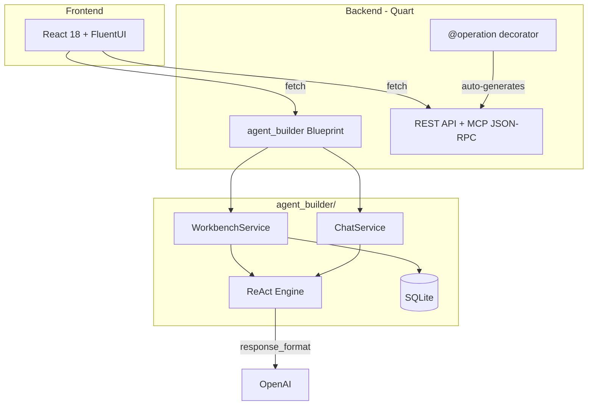

# Quart + Vite + React — CSV Ticket Analysis Platform

> A teaching-oriented full-stack application that pairs a Python Quart backend with a React + FluentUI frontend. Includes a **config-driven agent builder** for creating LLM-powered ticket analysis agents with structured output.

## Features

| Feature | Screenshot |
|---------|-----------|
| **CSV Tickets** — browse, filter, paginate imported ticket data |  |
| **Agent Fabric** — build agents from config (prompt, tools, output schema) |  |
| **Agent Chat** — one-shot chat with CSV ticket tools |  |
| **Usecase Demos** — pre-built analysis demos with editable prompts |  |
| **Fields** — CSV schema reference for all available ticket fields |  |

## Architecture



## Tech Stack

| Layer | Tech |
|-------|------|
| Backend | Python, [Quart](https://quart.palletsprojects.com/), Pydantic 2, SQLModel |
| Agents | [LangGraph](https://langchain-ai.github.io/langgraph/) ReAct, LangChain, OpenAI |
| Frontend | React 18, Vite, [FluentUI v9](https://react.fluentui.dev/), Nivo charts |
| Tests | Playwright E2E, pytest |
| Protocol | REST, MCP JSON-RPC, SSE |

## Quick Start

```bash
git clone <your-fork-url> && cd python-quart-vite-react
./setup.sh              # creates .venv, installs deps, Playwright
cp .env.example .env    # add your OPENAI_API_KEY
./start-dev.sh          # starts backend (5001) + frontend (3001)
```

Open http://localhost:3001

## Documentation

| Guide | Description |
|-------|-------------|
| **[Agent Builder](docs/AGENT_BUILDER.md)** | Architecture, mermaid diagrams, structured output, API reference |
| [Agents](docs/AGENTS.md) | LangGraph agent setup, config, tools |
| [Quick Start](docs/QUICKSTART.md) | Fastest path from clone to running |
| [Learning Guide](docs/LEARNING.md) | Grokking Simplicity + Philosophy of Software Design principles |
| [Project Structure](docs/PROJECT_STRUCTURE.md) | File-by-file overview |
| [Unified Architecture](docs/UNIFIED_ARCHITECTURE.md) | REST + MCP integration via @operation |
| [Pydantic Architecture](docs/PYDANTIC_ARCHITECTURE.md) | Models, validation, schema generation |
| [CSV AI Guidance](docs/CSV_AI_GUIDANCE.md) | How agents query CSV ticket data |
| [Nivo Charts](docs/NIVO.md) | Data visualization with Nivo |
| [Ubuntu Install](docs/INSTALL_UBUNTU.md) | Prerequisites for Ubuntu 22.04 |
| [Troubleshooting](docs/TROUBLESHOOTING.md) | Common issues and fixes |

## Agent Builder

The core feature — build LLM agents from config, no code required:

1. **Define** — name, system prompt, tools, output schema (JSON Schema)
2. **Suggest Schema** — LLM proposes structured output format from your description
3. **Run** — agent executes with LangGraph ReAct, structured output via `response_format`
4. **Evaluate** — success criteria (tool_called, output_contains, no_error, llm_judge)

Every agent returns typed JSON. Default: `{message: "markdown...", referenced_tickets: ["INC-001"]}`.

See **[docs/AGENT_BUILDER.md](docs/AGENT_BUILDER.md)** for full architecture.

## Project Layout

```
backend/
├── agent_builder/           # Config-driven agent module (see docs/AGENT_BUILDER.md)
│   ├── models/              # Pure data (Pydantic/SQLModel)
│   ├── engine/              # ReAct runner, prompt builder
│   ├── persistence/         # SQLite repository
│   ├── routes.py            # Quart Blueprint
│   └── tests/               # 132 tests
├── app.py                   # REST API + Blueprint registration
├── agents.py                # Simple chat agent
├── operations.py            # @operation definitions (REST + MCP + tools)
├── csv_data.py              # CSV ticket service
└── workbench_integration.py # Wires tools into agent_builder

frontend/src/features/
├── workbench/               # Agent Fabric UI
├── agent/                   # Agent chat
├── csvtickets/              # CSV ticket table
├── tickets/                 # Ticket visualizations (Nivo)
└── usecase-demo/            # Demo pages

tests/e2e/                   # Playwright browser tests
```

## Testing

```bash
# Backend unit + integration (132 tests)
cd backend && ./venv/bin/python -m pytest agent_builder/tests/ tests/ -v

# Playwright E2E (15 tests)
npx playwright test --project=chromium
```

## Docker

```bash
docker build -t quart-react-demo .
docker run --rm -p 5001:5001 -e OPENAI_API_KEY=sk-... quart-react-demo
# Open http://localhost:5001
```

## Troubleshooting

| Issue | Fix |
|-------|-----|
| Port 5001 in use | Find the process with `lsof -i :5001` and stop it |
| `.venv` broken | Recreate: `rm -rf .venv && python3 -m venv .venv && pip install -r backend/requirements.txt` |
| Playwright fails | `npx playwright install-deps && npx playwright install` |
| Agent errors | Check `OPENAI_API_KEY` in `.env` |

See [docs/TROUBLESHOOTING.md](docs/TROUBLESHOOTING.md) for more.

Happy coding!
