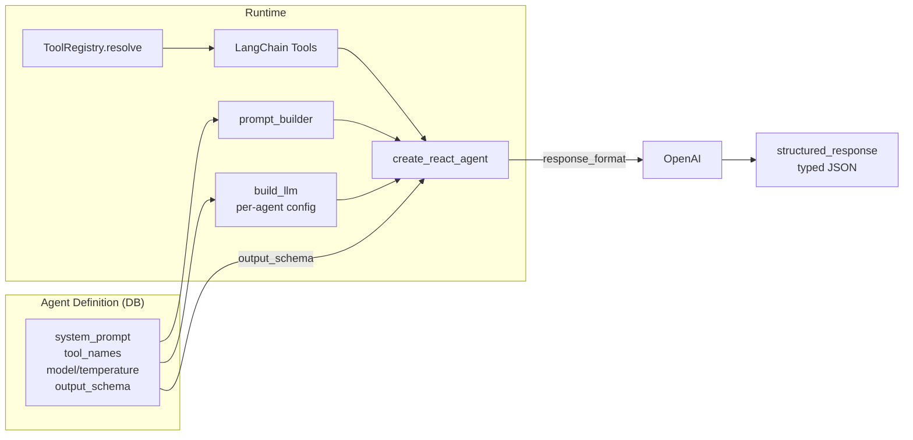

# LangGraph Agent Playground

> **📖 Full architecture documentation:** See **[AGENT_BUILDER.md](AGENT_BUILDER.md)** for mermaid diagrams, data flow, structured output pipeline, DB schema, and extensibility guide.

## Overview

Config-driven LLM agents built with LangGraph. Define an agent in the UI (system prompt, tools, output schema) → it's stored in SQLite → runs as a ReAct agent with structured output.

## Architecture



### Components

```
backend/agent_builder/         # Canonical module
├── models/                    # Pure data (Pydantic/SQLModel)
├── tools/                     # ToolRegistry, schema converter
├── engine/                    # ReAct runner, prompt builder, callbacks
├── evaluator.py               # Success criteria evaluation
├── persistence/               # SQLite repository + migrations
├── service.py                 # WorkbenchService (CRUD + run + eval)
├── chat_service.py            # ChatService (one-shot)
├── routes.py                  # Quart Blueprint
└── tests/                     # 132 tests
```

### How It Works

1. **Operations → Tools**: The `@operation` decorator automatically converts functions to LangChain tools via `to_langchain_tool()`
2. **Agent Initialization**: `AgentService` loads all tools and creates a ReAct agent with Azure OpenAI
3. **Execution**: Agent receives user prompt, autonomously chooses tools, executes them, and returns results

### Example Flow

```
User: "Create a task to learn LangGraph"
  ↓
Agent (Reasoning): I need to use the create_task tool
  ↓
Agent (Acting): Calls create_task with {"title": "Learn LangGraph", "description": "..."}
  ↓
Task Service: Creates task in database
  ↓
Agent (Observing): Task created with ID xyz
  ↓
Agent (Response): "I've created a task titled 'Learn LangGraph' with ID xyz"
```

## Setup

### 1. Install Dependencies

```bash
source .venv/bin/activate
pip install -r backend/requirements.txt
```

Dependencies added:
- `python-dotenv==1.2.1` - Environment variable loading
- `langchain==1.1.0` - LangChain framework
- `langgraph==1.0.4` - LangGraph orchestration
- `openai==2.8.1` - OpenAI SDK
- `langchain-openai>=0.3.0` - Azure OpenAI integration

### 2. Configure Azure OpenAI

Copy the example environment file:

```bash
cp .env.example .env
```

Edit `.env` with your Azure OpenAI credentials:

```bash
AZURE_OPENAI_ENDPOINT=https://your-resource.openai.azure.com/
AZURE_OPENAI_API_KEY=your-api-key-here
AZURE_OPENAI_DEPLOYMENT=gpt-4
AZURE_OPENAI_API_VERSION=2024-02-15-preview
```

**Get credentials from**: https://portal.azure.com → Your OpenAI resource → Keys and Endpoint

### 3. Start the Server

```bash
cd backend
python app.py
```

You should see:
```
✓ Agent service initialized with Azure OpenAI
🚀 Unified Quart Server with Pydantic
...
```

If Azure OpenAI is not configured:
```
⚠ Agent service disabled: Azure OpenAI configuration is incomplete.
  To enable agents, configure Azure OpenAI in .env file
```

## Usage

### REST API

**Endpoint**: `POST /api/agents/run`

**Request**:
```json
{
  "prompt": "Create a task to learn LangGraph and list all current tasks",
  "agent_type": "task_assistant"
}
```

**Response**:
```json
{
  "result": "I've created a task titled 'Learn LangGraph'...",
  "agent_type": "task_assistant",
  "created_at": "2025-12-03T10:30:00",
  "tools_used": ["create_task", "list_tasks"],
  "error": null
}
```

### Example cURL

```bash
curl -X POST http://localhost:5001/api/agents/run \
  -H "Content-Type: application/json" \
  -d '{
    "prompt": "List all my tasks",
    "agent_type": "task_assistant"
  }'
```

### MCP Integration

The agent endpoint is automatically exposed via MCP:

```json
{
  "jsonrpc": "2.0",
  "method": "tools/call",
  "params": {
    "name": "run_agent",
    "arguments": {
      "request": {
        "prompt": "Create a task",
        "agent_type": "task_assistant"
      }
    }
  }
}
```

## Available Tools (Automatically Exposed)

The agent has access to all `@operation` decorated functions:

### Task Management
- `create_task` - Create new tasks
- `get_task` - Retrieve task by ID
- `update_task` - Update task properties
- `delete_task` - Delete tasks
- `list_tasks` - List all/filtered tasks
- `get_task_stats` - Get task statistics

### Ollama (if running)
- `ollama_chat` - Chat with local Ollama models
- `list_ollama_models` - List available models

## Code Structure

### agents.py

**Data Models** (Pydantic):
- `AgentRequest` - Input validation for agent requests
- `AgentResponse` - Structured output with metadata

**Service Layer**:
- `AgentService.__init__()` - Initializes Azure OpenAI client, loads tools
- `AgentService.run_agent()` - Executes ReAct agent loop
- `AgentService._build_state_graph()` - Example for custom LangGraph workflows (learning reference)

### api_decorators.py Extensions

**New Methods**:
- `Operation.to_langchain_tool()` - Converts operation to LangChain StructuredTool
- `Operation._create_pydantic_model_for_langchain()` - Generates Pydantic schema for tool args
- `get_langchain_tools()` - Returns all operations as tools

**Key Insight**: Every `@operation` decorated function automatically becomes:
1. REST endpoint (existing)
2. MCP tool (existing)
3. **LangChain agent tool (NEW!)**

## Learning Examples

### Simple Agent Usage

```python
from agents import AgentService, AgentRequest

service = AgentService()
result = await service.run_agent(
    AgentRequest(
        prompt="Create a task to learn Python",
        agent_type="task_assistant"
    )
)
print(result.result)
```

### Custom StateGraph (Advanced)

See `AgentService._build_state_graph()` docstring for a complete example of building custom multi-step workflows with LangGraph.

## Testing

### Manual Testing

```bash
# Test agent endpoint
curl -X POST http://localhost:5001/api/agents/run \
  -H "Content-Type: application/json" \
  -d '{"prompt": "What tasks do I have?", "agent_type": "task_assistant"}'
```

### Python Test

```python
import httpx

async def test_agent():
    async with httpx.AsyncClient() as client:
        response = await client.post(
            "http://localhost:5001/api/agents/run",
            json={
                "prompt": "Create 3 tasks: Learn LangGraph, Read docs, Build agent",
                "agent_type": "task_assistant"
            }
        )
        result = response.json()
        print(f"Agent: {result['result']}")
        print(f"Tools used: {result['tools_used']}")
```

## Troubleshooting

### Agent service disabled

**Symptom**: `⚠ Agent service disabled` on startup

**Solution**: Configure Azure OpenAI in `.env` file:
```bash
cp .env.example .env
# Edit .env with your credentials
```

### Import errors

**Symptom**: `ModuleNotFoundError: No module named 'langchain'`

**Solution**: Install dependencies:
```bash
pip install -r backend/requirements.txt
```

### Azure OpenAI errors

**Symptom**: `AuthenticationError` or `ResourceNotFoundError`

**Solution**: Verify in `.env`:
- `AZURE_OPENAI_ENDPOINT` is correct (includes https://)
- `AZURE_OPENAI_API_KEY` is valid
- `AZURE_OPENAI_DEPLOYMENT` matches your Azure deployment name
- `AZURE_OPENAI_API_VERSION` is supported (recommend `2024-02-15-preview`)

### Agent not using tools

**Symptom**: Agent returns text without calling tools

**Solution**: 
- Make prompt more explicit: "Use the create_task tool to create a task..."
- Check Azure OpenAI deployment supports function calling (gpt-4, gpt-35-turbo)
- Increase temperature if agent is too conservative

## Advanced Topics

### Adding Custom Tools

Tools are automatically created from `@operation` decorators:

```python
@operation(
    name="custom_operation",
    description="Does something useful",
    http_method="POST",
    http_path="/api/custom"
)
async def op_custom(param: CustomModel) -> ResponseModel:
    # Implementation
    return result
```

This operation is now:
- Available via REST at `POST /api/custom`
- Available via MCP as `custom_operation`
- **Available to agents automatically!**

### Building Custom Workflows

For complex multi-step workflows, use LangGraph's StateGraph:

```python
from langgraph.graph import StateGraph, END
from typing import TypedDict

class WorkflowState(TypedDict):
    input: str
    plan: str
    result: str

workflow = StateGraph(WorkflowState)
workflow.add_node("planner", plan_step)
workflow.add_node("executor", execute_step)
workflow.add_edge("planner", "executor")
workflow.add_edge("executor", END)

agent = workflow.compile()
```

See `agents.py:_build_state_graph()` for detailed example.

## References

- [LangGraph Documentation](https://langchain-ai.github.io/langgraph/)
- [LangChain Documentation](https://docs.langchain.com/)
- [Azure OpenAI Documentation](https://learn.microsoft.com/azure/ai-services/openai/)
- [ReAct Pattern Paper](https://arxiv.org/abs/2210.03629)

## Next Steps

1. ✅ Basic ReAct agent with task tools
2. **Add memory**: Implement conversation history
3. **Add RAG**: Integrate vector store for task search
4. **Multi-agent**: Create specialized agents (planner, executor, reviewer)
5. **Human-in-the-loop**: Add approval workflow for destructive operations
6. **Streaming**: Stream agent thinking process to client
