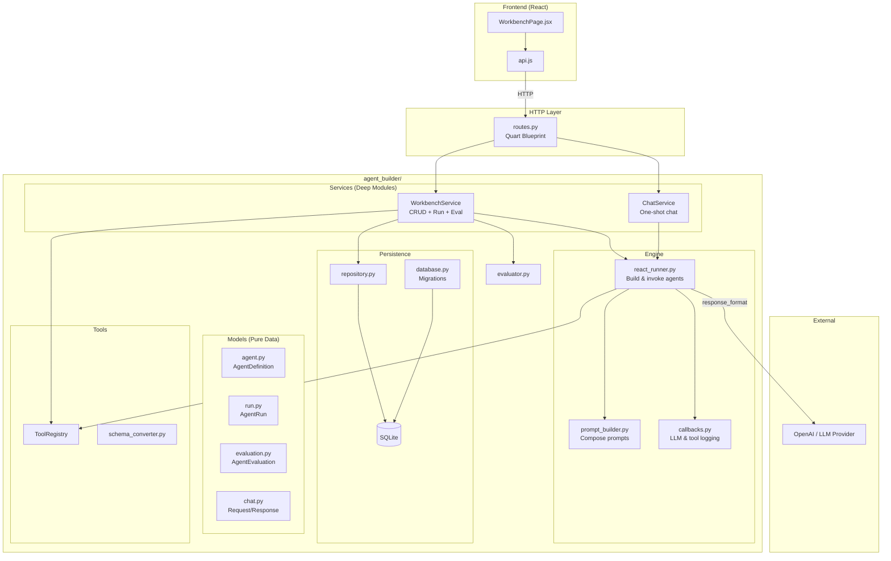
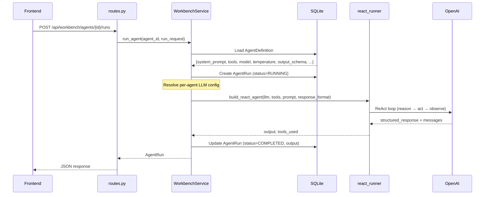
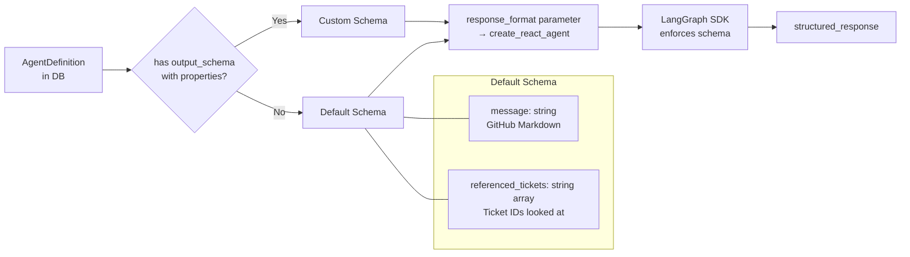
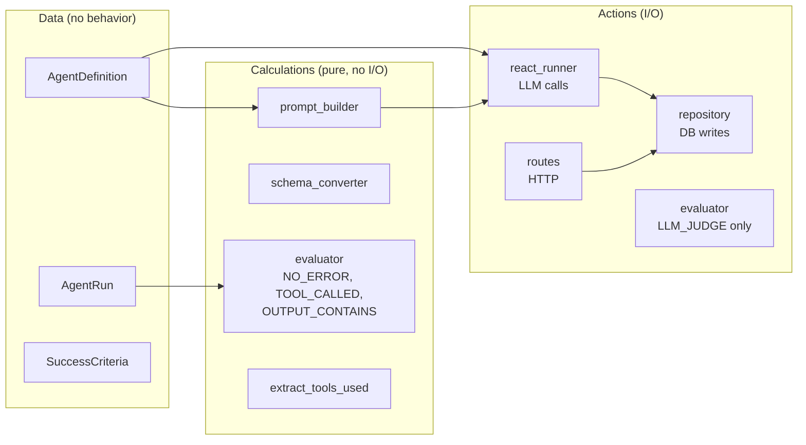
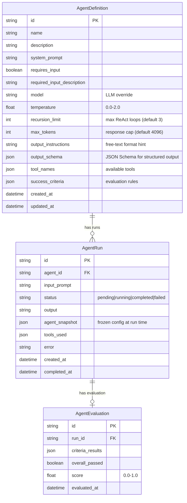

# Agent Builder

A self-contained, extensible module for building, running, and evaluating LLM-powered agents from configuration stored in a database.

## Architecture



## Data Flow: Agent Run



## Structured Output Pipeline

Every agent returns typed, structured output — never raw strings.



**Default output** (no custom schema):
```json
{
  "message": "## Analysis\nFound 3 critical tickets...",
  "referenced_tickets": ["INC-001", "INC-042", "INC-187"]
}
```

**Custom output** (with `output_schema`):
```json
{
  "breaches": [
    {"ticket_id": "INC-001", "sla_hours": 72, "breach_reason": "No assignment"}
  ],
  "total": 1
}
```

## Module Structure

```
backend/agent_builder/
├── __init__.py              # Public API facade
├── models/
│   ├── agent.py             # AgentDefinition, Create/Update DTOs
│   ├── run.py               # AgentRun, RunStatus
│   ├── evaluation.py        # Evaluation, SuccessCriteria, CriteriaType
│   └── chat.py              # AgentRequest/Response (simple chat)
├── tools/
│   ├── registry.py          # ToolRegistry (dependency injection)
│   ├── schema_converter.py  # JSON Schema → Pydantic (calculation)
│   └── mcp_adapter.py       # MCP tool → LangChain adapter
├── engine/
│   ├── react_runner.py      # Build & invoke ReAct agents
│   ├── prompt_builder.py    # System prompt composition (calculation)
│   └── callbacks.py         # LLM & tool call logging
├── evaluator.py             # Success criteria evaluation
├── service.py               # WorkbenchService (deep module)
├── chat_service.py          # ChatService (deep module)
├── persistence/
│   ├── database.py          # SQLite engine + migrations
│   └── repository.py        # Agent/Run/Evaluation CRUD
├── routes.py                # Quart Blueprint (/api/workbench/*)
└── tests/                   # 132 tests
```

## Design Principles

### Grokking Simplicity: Data / Calculations / Actions



### A Philosophy of Software Design: Deep Modules

| Module | Public API | Hidden Complexity |
|--------|-----------|-------------------|
| **WorkbenchService** | `create_agent`, `run_agent`, `evaluate_run` | DB sessions, LLM wiring, tool resolution, per-agent config, snapshot capture, structured output extraction |
| **ChatService** | `run_agent(request)` | LLM setup, prompt building, ReAct execution, tool logging |
| **ToolRegistry** | `register`, `resolve` | Name validation, deduplication, missing-tool tolerance |
| **Quart Blueprint** | 15 routes, 1 `register_blueprint()` call | Error handling, JSON marshaling, validation |

## Agent Definition (DB Schema)



## API Endpoints

| Method | Path | Description |
|--------|------|-------------|
| GET | `/api/workbench/ui-config` | UI metadata, enums, defaults, default schema |
| GET | `/api/workbench/tools` | Available tools with input schemas |
| POST | `/api/workbench/suggest-schema` | LLM-powered schema suggestion |
| GET | `/api/workbench/agents` | List all agents |
| POST | `/api/workbench/agents` | Create agent |
| GET | `/api/workbench/agents/{id}` | Get agent |
| PUT | `/api/workbench/agents/{id}` | Update agent |
| DELETE | `/api/workbench/agents/{id}` | Delete agent |
| POST | `/api/workbench/agents/{id}/runs` | Run agent |
| GET | `/api/workbench/agents/{id}/runs` | List runs for agent |
| GET | `/api/workbench/runs` | List all runs |
| GET | `/api/workbench/runs/{id}` | Get run |
| POST | `/api/workbench/runs/{id}/evaluate` | Evaluate run |
| GET | `/api/workbench/runs/{id}/evaluation` | Get evaluation |
| POST | `/api/agents/run` | Simple chat agent |

## Extensibility

```mermaid
flowchart TB
    subgraph "Add New Tool Source"
        T1[Write StructuredTool] --> T2[registry.register]
    end

    subgraph "Add New Criteria Type"
        C1[Add to CriteriaType enum] --> C2[Add branch in evaluator.py]
    end

    subgraph "Add New Agent Type"
        A1[New system_prompt + tools] --> A2[POST /api/workbench/agents]
    end

    subgraph "Custom Output Format"
        O1[Define JSON Schema] --> O2[Set output_schema on agent]
        O2 --> O3[SDK enforces at runtime]
    end

    subgraph "Different LLM Per Agent"
        L1[Set model field] --> L2[Per-agent ChatOpenAI built at runtime]
    end
```



## Testing

```bash
# Unit + integration tests (132 tests, ~6s)
cd backend && ./venv/bin/python -m pytest agent_builder/tests/ -v

# Original E2E tests
./venv/bin/python -m pytest tests/ -v

# Playwright browser tests (15 tests, ~8s)
npx playwright test --project=chromium

# All together
./venv/bin/python -m pytest agent_builder/tests/ tests/ -v && npx playwright test --project=chromium
```

## Backward Compatibility

`agent_workbench/` still works as a shim:
```python
# Old import (still works)
from agent_workbench import WorkbenchService, ToolRegistry

# New import (canonical)
from agent_builder import WorkbenchService, ToolRegistry
```
