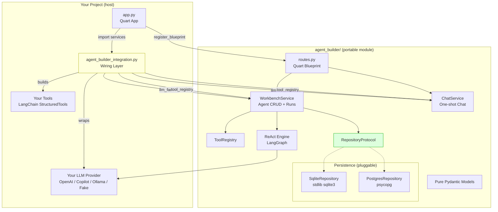
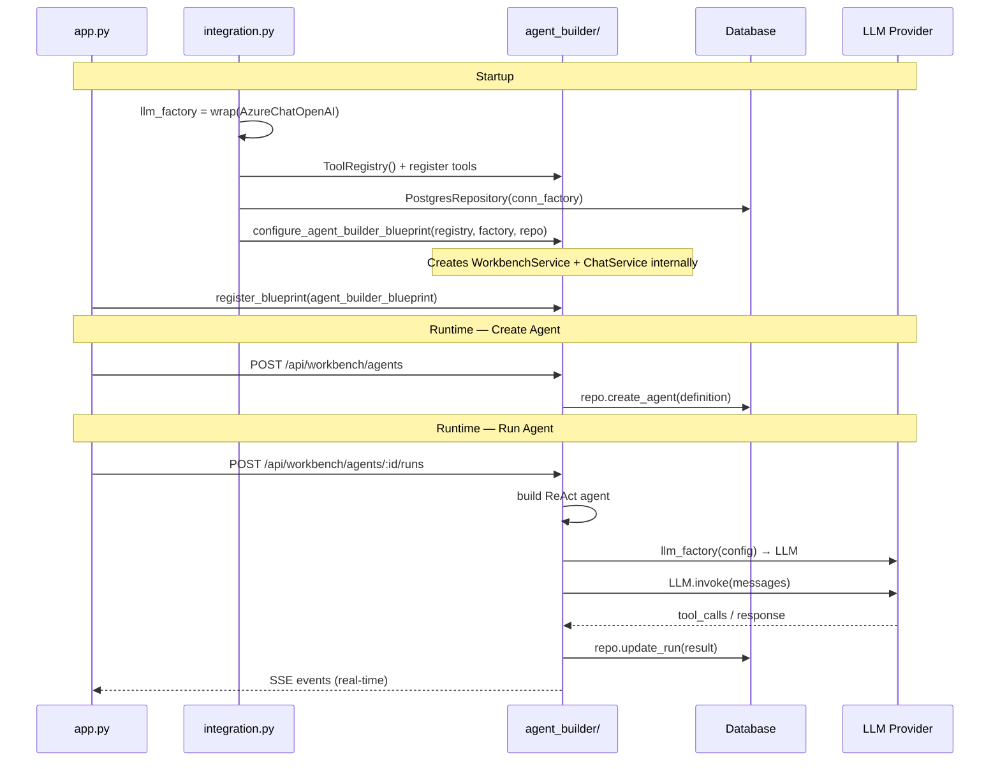

# Agent Builder Integration Guide

## Architecture Overview



## What the Integration File Does

The integration file (`agent_builder_integration.py`) bridges your project and the `agent_builder/` module. It provides **4 things**:

| # | What | Required? | Convention Possible? |
|---|------|-----------|---------------------|
| 1 | **LLM Factory** | ✅ Yes | ❌ No — project-specific (which provider, which env vars) |
| 2 | **Tool Registry** | ✅ Yes | ⚠️ Partially — `ToolRegistry()` + `register_all(tools)` is always the same pattern |
| 3 | **Model Catalog** | ❌ Optional | ✅ Yes — could derive from LLM factory config |
| 4 | **Domain Context** | ❌ Optional | ✅ Yes — default empty string works |

### What's NOT needed for robit-x

| This project's feature | Needed in robit-x? | Why not |
|------------------------|--------------------|---------| 
| `ChatService` | ❌ No | robit-x has its own chat graph (`agent/graph.py`) |
| `build_chat_system_prompt()` | ❌ No | German CSV-ticket specific |
| `TICKET_DOMAIN_CONTEXT` | ❌ No | CSV-ticket domain, robit-x has its own domain |
| `_build_model_catalog_provider()` | ❌ Optional | Nice-to-have for UI, not required |
| `csv_*` tool filtering | ❌ No | robit-x has different tools |
| `copilot_llm` import | ❌ No | robit-x uses Azure OpenAI |

## Integration Checklist for robit-x

```
☐ 1. Copy agent_builder/ into app/backend/agent_builder/
☐ 2. Add psycopg to requirements (already present via langgraph-checkpoint-postgres)
☐ 3. Write LLM factory (4 lines — wraps AzureChatOpenAI)
☐ 4. Create tool registry (register robit-x tools)
☐ 5. Create PostgresRepository (use existing db_config)
☐ 6. Call configure_agent_builder_blueprint() + register blueprint
```

### Step-by-step

#### Step 1: Copy the module
```bash
cp -r python-quart-vite-react/backend/agent_builder robit-x/app/backend/agent_builder
```

#### Step 2: Dependencies
Already satisfied — robit-x has `pydantic`, `langchain-core`, `langgraph`, `psycopg`.

#### Step 3: LLM Factory (minimal)
```python
# robit-x/app/backend/agent_builder_integration.py

from langchain_openai import AzureChatOpenAI
from agent_builder import WorkbenchService, ToolRegistry
from agent_builder.llm_protocol import LLMConfig
from agent_builder.persistence.postgres import PostgresRepository

def llm_factory(config: LLMConfig):
    return AzureChatOpenAI(
        azure_deployment=config.model or "gpt-4o",
        temperature=config.temperature,
        max_tokens=config.max_tokens or None,
    )
```

#### Step 4: Tool Registry
```python
from agent_builder import ToolRegistry

registry = ToolRegistry()
# Register any LangChain tools robit-x already has
# registry.register_all(your_tools)
```

#### Step 5: PostgresRepository
```python
import psycopg
from agent_builder.persistence.postgres import PostgresRepository

def make_repo(db_config, token_provider):
    def conn_factory():
        token = token_provider()  # Entra ID token refresh
        return psycopg.connect(
            host=db_config["host"],
            dbname=db_config["dbname"],
            user=db_config["user"],
            password=token,
            sslmode="require",
        )
    return PostgresRepository(conn_factory=conn_factory)
```

#### Step 6: Configure and register blueprint
```python
from agent_builder.routes import agent_builder_blueprint, configure_agent_builder_blueprint

configure_agent_builder_blueprint(
    tool_registry=registry,
    llm_factory=llm_factory,
    repo=repo,
)
app.register_blueprint(agent_builder_blueprint)
```

## Integration Points Diagram



## What Could Be Convention (simplification ideas)

1. **Auto-discover tools**: Instead of manually building a `ToolRegistry`, the module could scan for `@tool`-decorated functions in a configurable package path.

2. **Default LLM factory from env**: A built-in `default_llm_factory()` that reads `OPENAI_API_KEY`, `AZURE_OPENAI_*`, or `AGENT_BACKEND=fake` — covers 90% of cases without custom code.

3. **Auto-create repository from `DATABASE_URL`**: Accept a connection string env var and auto-detect SQLite vs PostgreSQL.

4. **Single `init_agent_builder(app, ...)` call**: Replace the 3-step pattern (create services → configure blueprint → register) with one function:
   ```python
   from agent_builder import init_agent_builder
   init_agent_builder(app, llm_factory=..., tools=[...], database_url="...")
   ```

These conventions would reduce the integration file from ~220 lines to ~10 lines for common cases, while keeping the current explicit approach available for advanced setups.
