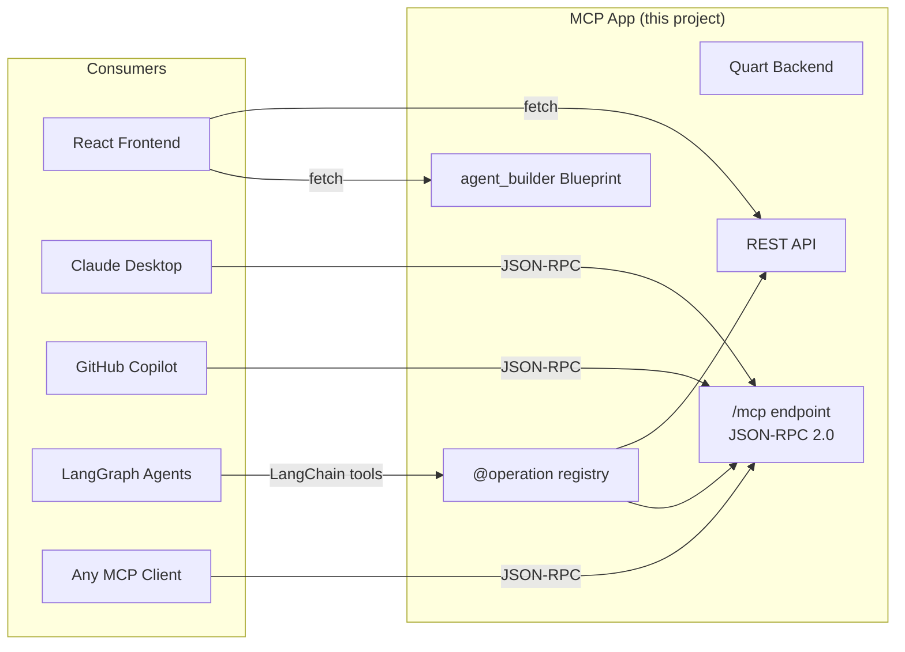
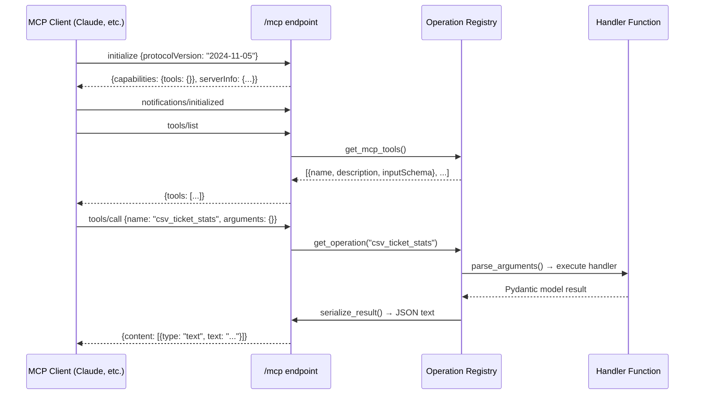
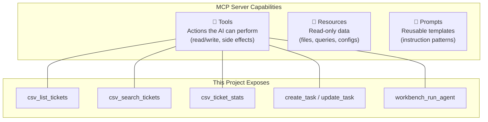
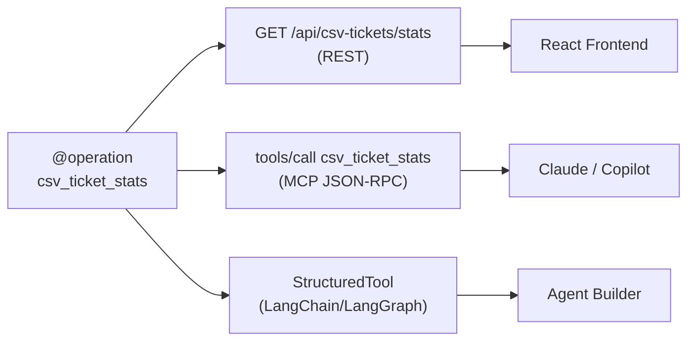
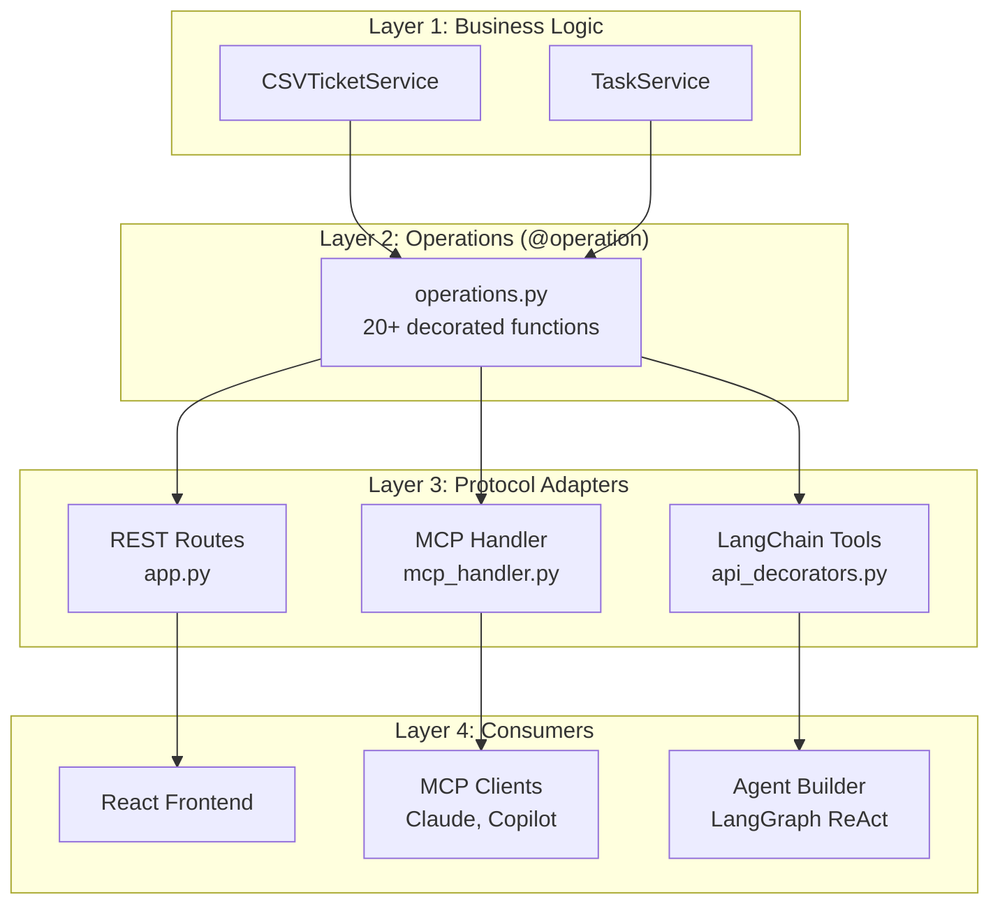

# MCP App: Technical Architecture

> How this project uses the **Model Context Protocol (MCP)** to turn business logic into AI-consumable tools — and how to extend it.

## What is an MCP App?

An **MCP App** is an application that exposes its functionality as an MCP server. Instead of only serving REST APIs for human-built frontends, it also serves **tools**, **resources**, and **prompts** via the MCP protocol — making its capabilities discoverable and invocable by any AI agent (Claude, Copilot, custom LangGraph agents, etc.).



**The key insight:** define business logic once with `@operation`, get REST + MCP + LangChain tools automatically.

## How MCP Works in This Project

### The Protocol



### Transport & Protocol Details

| Aspect | Implementation |
|--------|---------------|
| **Protocol** | JSON-RPC 2.0 |
| **Transport** | HTTP POST to `/mcp` |
| **Version** | MCP `2024-11-05` |
| **Content type** | `application/json` |
| **Authentication** | None (add OAuth/API key for production) |
| **Statefulness** | Stateless (each request is independent) |

### The Three MCP Primitives



Currently this project exposes **Tools** only. Resources and Prompts are future extensions (see below).

## The @operation Decorator: Single Source of Truth

```python
@operation(
    name="csv_ticket_stats",
    description="Get ticket statistics (total, by_status, by_priority, by_group, by_city)",
    http_method="GET",
    http_path="/api/csv-tickets/stats",
)
async def op_csv_ticket_stats() -> dict:
    service = get_csv_ticket_service()
    return service.get_ticket_stats()
```

This single declaration creates **three interfaces**:



**Schema generation is automatic** — Pydantic models on the function signature generate JSON Schema for all three interfaces.

## How to Connect an MCP Client

### Claude Desktop

Add to `claude_desktop_config.json`:
```json
{
  "mcpServers": {
    "ticket-analyzer": {
      "url": "http://localhost:5001/mcp"
    }
  }
}
```

### Any MCP Client (Python)

```python
from fastmcp import Client

async with Client("http://localhost:5001/mcp") as client:
    # Discover tools
    tools = await client.list_tools()
    for t in tools:
        print(f"{t.name}: {t.description}")
    
    # Call a tool
    result = await client.call_tool("csv_ticket_stats", {})
    print(result)
```

### curl (raw JSON-RPC)

```bash
# Initialize
curl -X POST http://localhost:5001/mcp \
  -H "Content-Type: application/json" \
  -d '{"jsonrpc":"2.0","method":"initialize","params":{"protocolVersion":"2024-11-05","capabilities":{}},"id":1}'

# List tools
curl -X POST http://localhost:5001/mcp \
  -H "Content-Type: application/json" \
  -d '{"jsonrpc":"2.0","method":"tools/list","params":{},"id":2}'

# Call a tool
curl -X POST http://localhost:5001/mcp \
  -H "Content-Type: application/json" \
  -d '{"jsonrpc":"2.0","method":"tools/call","params":{"name":"csv_ticket_stats","arguments":{}},"id":3}'
```

## Architecture: How It All Fits Together



## Extending: Adding Resources and Prompts

### Future: MCP Resources

Resources are read-only data the AI can browse. To add:

```python
# In mcp_handler.py, handle "resources/list" and "resources/read"
# Example resources:
# - resource://tickets/schema   → CSV field definitions
# - resource://tickets/stats    → live ticket statistics
# - resource://agents/{id}      → agent definition as context
```

### Future: MCP Prompts

Prompts are reusable instruction templates. To add:

```python
# In mcp_handler.py, handle "prompts/list" and "prompts/get"
# Example prompts:
# - "analyze_vpn_issues"  → pre-built VPN analysis prompt
# - "sla_breach_report"   → SLA breach detection prompt
# - "ticket_triage"       → ticket classification prompt
```

### Future: Streaming (SSE Transport)

For long-running operations, upgrade from HTTP POST to SSE:

```python
# MCP supports Server-Sent Events for streaming results
# This project already has SSE infrastructure (Dashboard feature)
# Extension: stream agent execution progress via MCP
```

## Security Considerations

| Concern | Current State | Production Recommendation |
|---------|--------------|--------------------------|
| Authentication | None | Add OAuth 2.0 or API key validation |
| Authorization | All tools public | Per-tool RBAC based on MCP client identity |
| Input validation | Pydantic (automatic) | ✅ Already handled |
| Rate limiting | None | Add per-client rate limits |
| Audit logging | Tool call logging | Add structured audit trail |
| Tool approval | No consent UI | Add human-in-the-loop for destructive operations |

## References

- [MCP Specification (2025-03-26)](https://modelcontextprotocol.io/specification/2025-03-26)
- [MCP Architecture](https://modelcontextprotocol.io/docs/concepts/architecture)
- [FastMCP Python SDK](https://gofastmcp.com)
- [MCP Server Concepts](https://modelcontextprotocol.io/docs/learn/server-concepts)
- [IBM: MCP Architecture Patterns for Multi-Agent Systems](https://developer.ibm.com/articles/mcp-architecture-patterns-ai-systems/)
- [a16z: Deep Dive into MCP](https://a16z.com/a-deep-dive-into-mcp-and-the-future-of-ai-tooling/)
