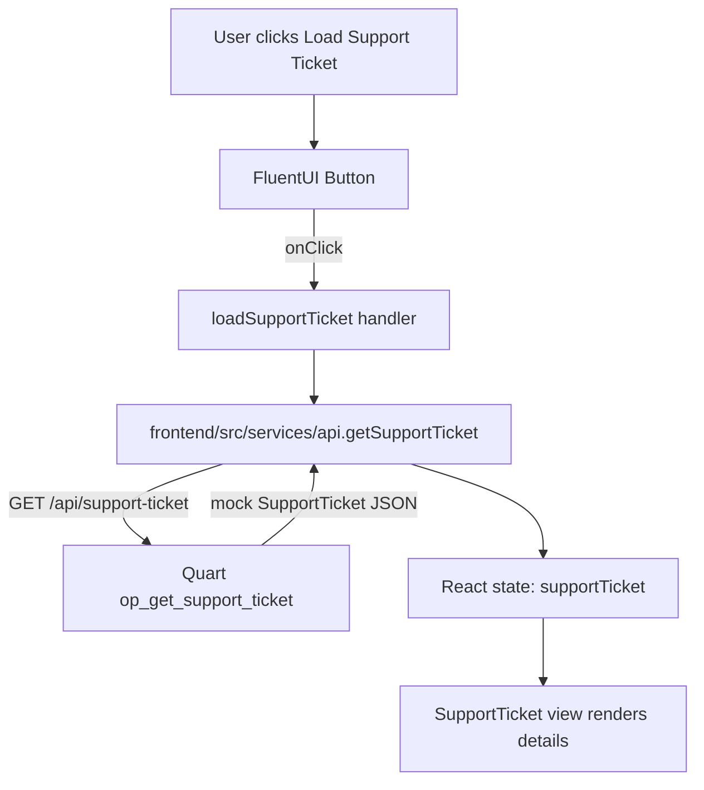

# Support Ticket Feature Design

## Goals
- Introduce a mock Support Ticket capability without touching production data sources.
- Keep unified REST + MCP contract by defining the feature via the existing `@operation` decorator in `backend/app.py`.
- Provide a dedicated navigation entry and page within `frontend/src/App.jsx` to keep feature-first structure intact.
- Offer a single, deterministic "Load Support Ticket" button that fetches and renders the ticket payload.

## Backend Mock API (`backend/app.py`)
- **New operation**: `op_get_ticket` declared with `@operation(name="get_support_ticket", http_method="GET", http_path="/api/ticket")` returning a typed `SupportTicket` Pydantic model (can live in `backend/tasks.py` next to other models or inline as a nested model if preferable).
- **Mock payload fields** (extendable later):
  - `ticket_id`: string, e.g., `"SUP-2025-0042"`.
  - `subject`: short summary, e.g., `"Unable to access premium dashboard"`.
  - `customer`: object `{ "name": "Dana Rivera", "account": "ACME-8891" }`.
  - `priority`: enum-like string (`"low" | "medium" | "high" | "urgent"`).
  - `status`: string (`"open"`, etc.).
  - `service`: string (e.g. "Microsoft Teams")
  - `last_updated`: ISO datetime (reuse `format_datetime`).
  - `description`: multiline text describing the issue.
- **REST wrapper**: Expose `GET /api/ticket` mirroring other endpoints; JSON body is `support_ticket.model_dump()`.
- **MCP exposure**: Automatic via `@operation`; the MCP `tools/list` response should now include `get_support_ticket` so copilots can fetch the same data.
- **Sample response** (for docs/tests):
  ```json
  {
    "ticket_id": "SUP-2025-0042",
    "subject": "Unable to access premium dashboard",
    "customer": {
      "name": "Dana Rivera",
      "account": "ACME-8891"
    },
    "priority": "urgent",
    "status": "open",
    "service": "Microsoft Teams",
    "last_updated": "2025-11-19T14:22:05.123456",
    "description": "Customer reports a 403 when loading the premium dashboard after upgrading their plan."
  }
  ```
- **Testing hooks**: Reuse `/api/health` style smoke checks; optional Playwright stub to assert this endpoint returns the subject string.

## Frontend Navigation & Page (`frontend/src/App.jsx` + new feature folder)
- **New Tab**: Append to `tabs` array: `{ value: 'support', label: 'Support Ticket', icon: <TicketDiagonalRegular />, path: '/support-ticket', testId: 'tab-support' }` (import icon from `@fluentui/react-icons`).
- **Routing**: Add `<Route path="/support-ticket" element={<SupportTicket />} />` pointing to `frontend/src/features/support/SupportTicket.jsx` (new folder mirrors feature-first convention).
- **Feature structure** (`frontend/src/features/support`):
  - `SupportTicket.jsx`: orchestrates state + FluentUI layout.
  - `supportActions.js`: optional helper exporting `loadSupportTicket` that calls `api.getSupportTicket()`.
  - `supportCalculations.js`: not required now, but keep placeholder if derived fields arrive later.
- **API client** (`frontend/src/services/api.js`):
  - Add `export async function getSupportTicket()` using `fetchJSON('/api/support-ticket')`.
  - Surface friendly `Error.message` following existing helpers.

## Support Ticket Page Behavior
- **Initial state**: No ticket fetched; show neutral illustration or `Text` component explaining "Press the button to load the latest support ticket.".
- **Button**: FluentUI `<Button appearance="primary" data-testid="load-support-ticket">Load Support Ticket</Button>` centered near top.
- **Click flow**:
  1. Disable button + show `Spinner` while awaiting API.
  2. On success, store payload in local state (`supportTicket`) and render details card.
  3. On failure, show `Alert`/`MessageBar` with error message and re-enable button.
- **Display layout**: Use `Card` + `CardHeader` for summary, `Body1` for description, and `Tag`/`Badge` for `priority` + `status`; include `data-testid` hooks like `ticket-subject`, `ticket-priority`.
- **Accessibility**: Announce load completion via `aria-live="polite"` region so screen readers capture new data.

## Example UX Copy
- Empty state text: "No support ticket loaded yet."
- Button tooltip: "Fetch the most recent escalated support ticket."
- Error fallback: "Unable to fetch the support ticket. Please try again." (include error code if available).

## Testing Considerations
- **Unit**: Mock `getSupportTicket` to resolve payload; assert button triggers fetch exactly once and state renders fields.
- **E2E (Playwright)**:
  - Navigate via `data-testid="tab-support"`.
  - Click button, wait for `ticket-subject` to contain sample subject.
  - Intercept `/api/support-ticket` to keep deterministic values if backend not running.

## High-Level Flow


## Rollout Checklist
- Verify new operation appears in `/mcp` `tools/list` response.
- Ensure `npm run lint` + backend type checks still pass after code addition.
- Update `README.md` "Features" section to mention Support Ticket tab once implemented.
- Consider feature flag if multiple tickets appear later (out of scope now).
