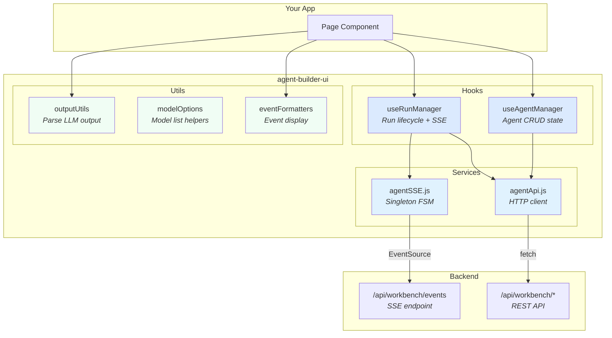
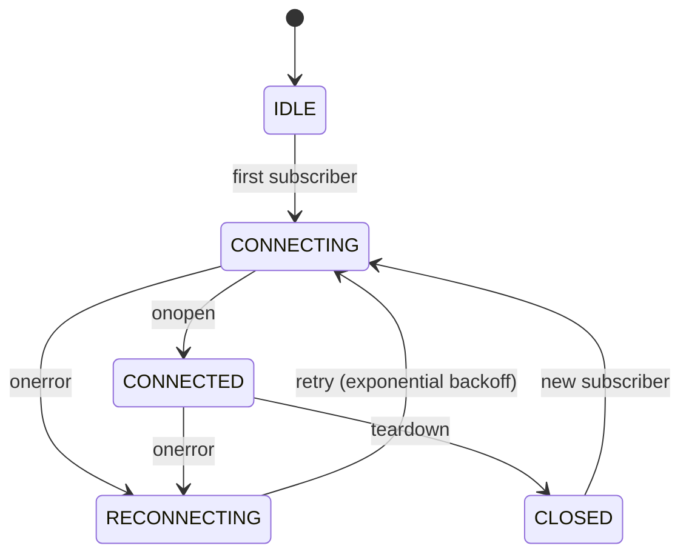
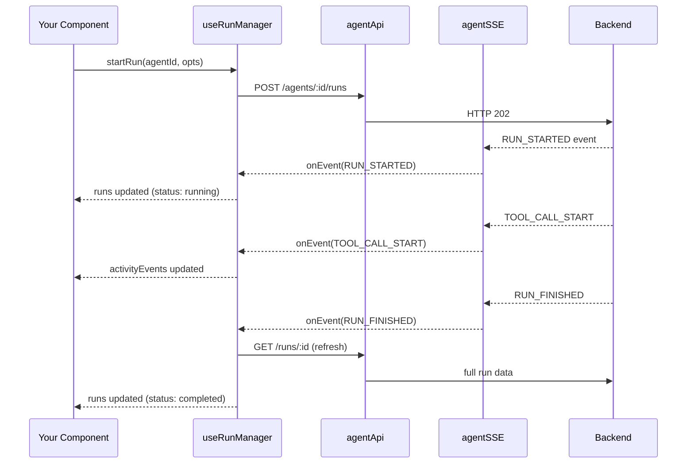

# Agent Builder UI

Reusable React hooks, services, and utilities for building agent-powered UIs on top of the `agent_builder` backend. Provides SSE real-time streaming, run lifecycle management, and agent CRUD — all as composable building blocks.

## Architecture



## SSE Connection — Real-Time Event Streaming

The SSE layer is a **singleton finite state machine** that maintains one `EventSource` connection shared across the entire app. Multiple components subscribe independently; the connection opens automatically on first subscriber.



### Configuration

```javascript
import { configureAgentBuilder, subscribeSSE, SSE_STATE } from './agent-builder-ui'

// Optional: configure both API base URL and SSE endpoint in one call
configureAgentBuilder({
  apiBase: '/api',                       // default: /api
  sseUrl: '/api/workbench/events',       // default: /api/workbench/events
})

// Or configure individually:
// import { configureApi } from './agent-builder-ui'
// configureApi('/my-api')
// import { configureSSE } from './agent-builder-ui'
// configureSSE('/my-sse-endpoint')

// Subscribe to events
const unsubscribe = subscribeSSE({
  onEvent: (event) => {
    // event.type: RUN_STARTED | RUN_FINISHED | RUN_ERROR |
    //             STEP_STARTED | STEP_FINISHED |
    //             TOOL_CALL_START | TOOL_CALL_END | TOOL_CALL_RESULT
    console.log(event.type, event.runId)
  },
  onStateChange: (state) => {
    // state: idle | connecting | connected | reconnecting | closed
    console.log('SSE:', state)
  },
})

// Later: stop listening
unsubscribe()
```

## Hooks

### `useRunManager` — Run Lifecycle

Manages all agent runs with real-time SSE updates. Single source of truth for run state.



```jsx
import { useRunManager } from './agent-builder-ui'

function MyAgentPage({ agentId }) {
  const {
    runs,           // Sorted array of run objects (newest first)
    loading,        // Initial load in progress
    startRun,       // (agentId, { inputPrompt }) → run
    loadRuns,       // Reload all from API
    clearAllRuns,   // Delete all runs
    getRunActivity, // (runId) → activity events array
    getRunState,    // (runId) → { run, status, activityEvents }
    refreshRun,     // (runId) → refresh single run from API
  } = useRunManager()

  const handleRun = async () => {
    const run = await startRun(agentId, { inputPrompt: 'Analyze tickets' })
    console.log('Started:', run.id)  // status is already "running"
  }

  return (
    <div>
      <button onClick={handleRun}>Run Agent</button>
      {runs.map(run => (
        <div key={run.id}>
          {run.status} — {run.output?.slice(0, 100)}
        </div>
      ))}
    </div>
  )
}
```

### `useAgentManager` — Agent CRUD + Config

Loads agents, tools, and UI config in one hook. Provides create/update/delete with automatic refresh.

```jsx
import { useAgentManager } from './agent-builder-ui'

function AgentList() {
  const {
    agents,       // Array of agent definitions
    tools,        // Array of available tools
    uiConfig,     // UI configuration metadata
    loading,      // Loading state
    createAgent,  // (agentData) → created agent
    updateAgent,  // (agentId, agentData) → updated agent
    deleteAgent,  // (agentId) → void
    refresh,      // Manual refresh
  } = useAgentManager()

  return (
    <ul>
      {agents.map(agent => (
        <li key={agent.id}>
          {agent.name}
          <button onClick={() => deleteAgent(agent.id)}>Delete</button>
        </li>
      ))}
    </ul>
  )
}
```

## Utilities

### `parseRunOutput(output)` — Parse LLM Output

Handles all output formats: JSON objects, JSON strings, markdown-fenced JSON, and plain text.

```javascript
import { parseRunOutput } from './agent-builder-ui'

parseRunOutput('{"message": "hello"}')      // → { message: "hello" }
parseRunOutput('```json\n{"a":1}\n```')      // → { a: 1 }
parseRunOutput('Just plain text')            // → { message: "Just plain text" }
parseRunOutput(null)                         // → null
```

### `buildModelOptions(options, currentModel)` — Normalize Model List

Deduplicates and preserves order for model dropdowns.

```javascript
import { buildModelOptions } from './agent-builder-ui'

buildModelOptions(['gpt-4o', 'gpt-4o-mini'], 'gpt-4o')
// → ['gpt-4o', 'gpt-4o-mini']
```

### Event Formatters — Display SSE Events

Pure functions for rendering SSE events in activity monitors.

```javascript
import { formatTime, shortId, eventSummary, eventDetail } from './agent-builder-ui'

formatTime(1712444400)          // → "22:00:00"
shortId('abc12345-long-uuid')   // → "abc12345"
eventSummary({ type: 'TOOL_CALL_START', toolCallName: 'csv_search' })
// → "→ csv_search"
eventDetail({ type: 'RUN_ERROR', message: 'Timeout' })
// → "Timeout"
```

## File Structure

```
agent-builder-ui/
├── index.js                  ← Barrel export (import from here)
├── services/
│   ├── agentSSE.js           ← SSE singleton FSM
│   └── agentApi.js           ← REST API client (18 endpoints)
├── hooks/
│   ├── useRunManager.js      ← Run lifecycle + SSE tracking
│   └── useAgentManager.js    ← Agent CRUD + tools + config
├── utils/
│   ├── outputUtils.js        ← parseRunOutput()
│   ├── modelOptions.js       ← buildModelOptions()
│   └── eventFormatters.js    ← formatTime, shortId, eventSummary, eventDetail
└── components/               ← (future: SchemaRenderer, ChatPanel)
```

## Peer Dependencies

- `react` ≥ 18

No UI framework dependency — hooks and utils are headless. Bring your own components.
